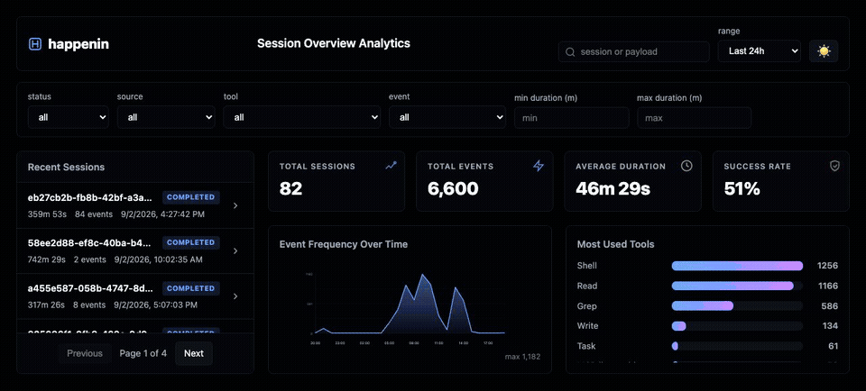

<p align="center">
  <picture>
    <source media="(prefers-color-scheme: dark)" srcset="docs/banner-dark.png">
    
  </picture>
</p>

# happenin

[](https://snyk.io/test/npm/happenin)
[](https://npm.im/happenin)
[](docs/CODE_OF_CONDUCT.md)
[](http://makeapullrequest.com)

A CLI that records Cursor, Claude Code, and Devin agent events to a local SQLite database and serves a live browser dashboard.



## Try it

```bash
npx -y happenin install   # show plugin setup for Cursor, Claude Code, and Devin
npx -y happenin import    # import existing transcripts
npx -y happenin dashboard # open the live dashboard
```

No global install needed: the packaged hooks run through `npx`. For a permanent setup, use the [global install](#install).

## Why

Cursor, Claude Code, and Devin can emit local hooks for each session, tool use, prompt, file edit, and lifecycle event. `happenin` adds `record` hooks to those agents, writes the payloads to a local SQLite database, and serves a live browser dashboard. Data never leaves your machine.

## Stability

`happenin` is pre-1.0. The CLI, database schema, and dashboard output may change in small ways between releases until `v1.0.0`. Any breaking changes will be minor and listed in the [changelog](docs/CHANGELOG.md).

## Requirements

- macOS, Linux, or Windows
- Node.js `>= 22.13.0` (uses the built-in `node:sqlite` module, available since Node 22.13)
- Zero runtime dependencies
- The dashboard loads htmx and htmx-ext-sse from a CDN

## Install

```bash
npm install -g happenin
```

Or run from source:

```bash
git clone git@github.com:YogliB/happenin.git
cd happenin
npm install
npm run build
```

## Quick start

```bash
# Show the plugin setup for Cursor, Claude Code, and Devin
happenin install

# Import existing transcripts
happenin import

# Start the live dashboard
happenin dashboard
```

The dashboard opens at `http://localhost:8765`. New events appear automatically.

## Commands

### `happenin install [--cursor] [--claude] [--devin]`

Prints the supported plugin setup for Cursor, Claude Code, and Devin. The packaged plugins call `npx -y happenin record`, so they work with both the trial and global-install flows without rewriting `~/.cursor/hooks.json` or `~/.claude/settings.json`. Use `--cursor`, `--claude`, or `--devin` to show one client only.

Migrating from a pre-plugin install? Remove the old `happenin record` entries from `~/.cursor/hooks.json` and `~/.claude/settings.json` by hand (one-time step). Keep every unrelated hook.

```bash
happenin install --cursor
happenin install --claude
happenin install --devin
```

### `happenin record <source> [event]`

The hook target. Reads a JSON payload from stdin, writes it to `~/.happenin/happenin.db`, and prints the required non-blocking response for the agent.

- `source` — `cursor`, `claude`, or `devin`.
- `event` — only required for Claude; Cursor and Devin payloads include `hook_event_name`.

This command is normally called by the agent hooks, not directly:

```bash
echo '{"hook_event_name":"sessionStart","sessionId":"abc123"}' | happenin record cursor
echo '{"sessionId":"abc123"}' | happenin record claude SessionStart
echo '{"hook_event_name":"PreToolUse","session_id":"abc123","tool_name":"exec"}' | happenin record devin
```

### `happenin import [--force]`

Imports existing transcripts:

- Claude Code JSONL from `~/.claude/projects/<project>/<session>.jsonl`. Each `tool_use` block in an
  assistant message becomes its own event with `tool_name` set (and `file_path` for file-editing
  tools, `skill_name` for `Skill` calls), so tool usage, skills used, and files touched are
  queryable per session and show up on the dashboard.
- Cursor `prompt_history.json` and `meta.json` from `~/.cursor/chats/<hash>/<session>/`.

`store.db` is skipped because it is encrypted.

Files are only re-parsed when their modification time changes; pass `--force` to clear that
tracking and re-import everything from scratch (useful after upgrading `happenin`).

### `happenin query [options]`

Query events from the local database and print them as JSON, JSONL, or a summary.

```bash
happenin query --limit 10
happenin query --source cursor --event subagentStart --format jsonl
happenin query --session abc123 --format summary
```

See [docs/USAGE.md](docs/USAGE.md) for all filters.

### `happenin sessions [options]`

Summarize recorded events grouped by session. Useful for reviewing activity across many sessions and event volumes.

```bash
happenin sessions --limit 10
happenin sessions --source cursor --format jsonl
happenin sessions --session abc123 --format summary
```

See [docs/USAGE.md](docs/USAGE.md) for all filters.

### `happenin dashboard [--port <port>] [--no-open] [--silent]`

Starts a local HTTP server and opens the dashboard.

- `--port` — port to listen on (default: `8765`).
- `--no-open` — do not open the browser.
- `--silent` — alias for `--no-open`; used automatically by `npm start`.

The main screen shows total sessions/events, average duration, and success rate for the selected
date range, plus charts for the top 10 tools, top 10 skills, and top 10 markdown files touched.
Clicking a tool, skill, or file jumps to a list of every session that used it. The markdown files
chart can be scoped to one directory with the "md files directory" filter (the common path prefix
is stripped from the dropdown labels, and paths under `/private` are excluded).

The persistent filter bar also has multi-select "directories", "skills", and "integrations (MCP)"
controls. Each lets you pick several values at once — matching sessions with _any_ of the selected
values in that category (OR) — and the categories combine with every other filter, including each
other, with AND (e.g. directory X or Y, AND skill A or B). The "integrations (MCP)" list is derived
from the data itself: it parses the `mcp__<server>__<tool>` naming convention on recorded tool
calls and lists every distinct MCP server actually seen, with no hardcoded set of servers.

A context breakdown widget splits recorded payload size (and, for imported Claude sessions, token
usage) into four buckets: MCP server calls, markdown file reads, bloatware (skill loads and
lifecycle/hook noise), and actual value (real tool calls and conversation turns). It appears on the
main dashboard for the current filter/date range, and again inside a session's detail view scoped
to that session. This is a heuristic, not an exact accounting — Claude Code does not log its system
prompt or tool schemas to the transcript, so there is no ground truth to bucket against.

The "Recent Sessions" bar above the charts is collapsed by default — clicking it replaces the
metrics/charts with the full session list; clicking it again (or picking a session) returns to the
previous view.

```bash
happenin dashboard --port 9000 --silent
```

## Configuration

- `HAPPENIN_DB` — override the SQLite database path. Default: `~/.happenin/happenin.db`.
- `NO_COLOR` — disable colored help output.

## Privacy

`happenin` stores full hook payloads and transcripts locally. No data is sent over the network except for the CDN-loaded dashboard libraries (htmx and htmx-ext-sse) when the dashboard is open.

## Development

```bash
nub install
nub run build
```

The same scripts also work with npm:

```bash
npm install
npm run build
```

Every pull request must reference an existing issue. If no issue exists, open one first, then link it in the pull request body with `Closes #<issue>`. CI enforces this on every pull request; bot PRs are skipped, and maintainers can bypass with the `no-issue` label.

Before opening a pull request, run the full check suite:

```bash
nub run build
nub run typecheck
nub run format
nub run lint
nub run duplicates:ci
nub run knip:ci
nub run test:ci
```

The same scripts also work with `npm run <script>`.

See [docs/CONTRIBUTING.md](docs/CONTRIBUTING.md) for details.

## Documentation

### User docs

| Doc                                                | Purpose                          |
| -------------------------------------------------- | -------------------------------- |
| [docs/ARCHITECTURE.md](docs/ARCHITECTURE.md)       | How the pieces fit together.     |
| [docs/USAGE.md](docs/USAGE.md)                     | Full usage guide.                |
| [docs/TROUBLESHOOTING.md](docs/TROUBLESHOOTING.md) | Common problems.                 |
| [docs/CHANGELOG.md](docs/CHANGELOG.md)             | Release notes.                   |
| [assets/help.md](assets/help.md)                   | CLI help text shown by `--help`. |

### Agent and LLM docs

| Doc                                                  | Purpose                           |
| ---------------------------------------------------- | --------------------------------- |
| [AGENTS.md](AGENTS.md)                               | Agent-facing entry point.         |
| [CLAUDE.md](CLAUDE.md)                               | Symlink to `AGENTS.md`.           |
| [llms.txt](llms.txt)                                 | LLM/AI index of docs and sources. |
| [skills/happenin/SKILL.md](skills/happenin/SKILL.md) | Cross-agent skill instructions.   |

## Agent skill

The Cursor, Claude Code, and Devin plugins bundle the reusable `happenin` skill, so installing the plugin installs the skill too. For other agents that support `SKILL.md` files, install it directly:

```bash
npx skills add YogliB/happenin --skill happenin
```

Then ask the agent to record or inspect agent events. The skill covers `install`, `record`, `import`, `query`, and `dashboard`, plus field extraction and required hook responses.

See [skills/happenin/SKILL.md](skills/happenin/SKILL.md) for the full instructions.

## License

[MIT](LICENSE.md)
